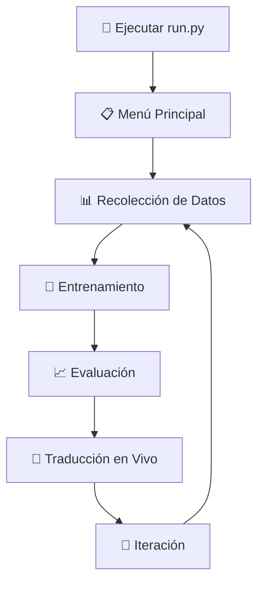

# 📚 Documentación del Sistema LSP v2.0 - Arquitectura Modular

## 🎯 Resumen de Migración Completada

El proyecto **LSP (Lenguaje de Señas Peruano)** ha sido completamente **reorganizado** de una arquitectura monolítica a una **arquitectura modular** siguiendo las mejores prácticas de desarrollo de software.

## 🏗️ Arquitectura Anterior vs Nueva

### ❌ Arquitectura Anterior (Monolítica)
```
LSP_Final/
├── data_c.py               # Todo el código en un solo archivo (950+ líneas)
├── run_collector.py        # Solo punto de entrada básico
├── data/                   # Datos sin organización
├── models/                 # Modelos MediaPipe
└── requirements.txt
```

### ✅ Nueva Arquitectura (Modular)
```
LSP/
├── 🚀 run.py                      # Sistema principal con menú unificado
├── 📂 src/                        # Código fuente modular
│   ├── __init__.py               # Paquete principal
│   ├── 📊 data_collection/       # Módulo de recolección
│   │   ├── main_collector.py     # Coordinador principal 
│   │   ├── mediapipe_manager.py  # Gestión MediaPipe
│   │   ├── feature_extractor.py  # Extracción de características
│   │   ├── motion_analyzer.py    # Análisis de movimiento
│   │   ├── ui_manager.py         # Interfaz de usuario
│   │   ├── data_manager.py       # Gestión de datos
│   │   └── sign_config.py        # Configuración de señas
│   ├── 🧠 training/              # Módulo de entrenamiento
│   │   └── train_gru.py          # Entrenamiento de modelos GRU
│   ├── 📈 evaluation/            # Módulo de evaluación
│   │   └── evaluate_model.py     # Evaluación de modelos
│   └── 🎯 inference/             # Módulo de inferencia
│       └── real_time_translator.py # Traducción en tiempo real
├── 🧪 tests/                     # Tests del sistema
│   ├── test_simple.py            # Tests básicos
│   └── test_collector.py         # Tests específicos
├── 📁 data/                      # Datos organizados
│   └── sequences/                # Secuencias de señas
├── 🧠 models/                    # Modelos entrenados y MediaPipe
├── 📚 docs/                      # Documentación completa
└── 📋 requirements.txt           # Dependencias
```

## 🎯 Ventajas de la Nueva Arquitectura

### 1. **🧩 Modularidad**
- Cada módulo tiene responsabilidades específicas
- Fácil mantenimiento y debugging
- Desarrollo en paralelo por equipos

### 2. **📋 Menús Independientes**
- Cada módulo tiene su propio menú interactivo
- Navegación intuitiva entre funcionalidades
- Experiencia de usuario mejorada

### 3. **🔄 Escalabilidad**
- Fácil agregar nuevos módulos
- Arquitectura preparada para crecimiento
- Separación clara de concerns

### 4. **🧪 Testabilidad**
- Tests específicos por módulo
- Validación automática del sistema
- Debugging más eficiente

### 5. **📚 Documentación**
- Documentación clara por módulo
- Guías específicas de uso
- Ejemplos de código organizados

## 🚀 Cómo Usar el Nuevo Sistema

### Opción 1: Sistema Completo (Recomendado)
```bash
python run.py
```
- Menú principal con todos los módulos
- Navegación fluida entre funcionalidades
- Experiencia integrada

### Opción 2: Módulos Individuales
```bash
# Solo recolección de datos
python -m src.data_collection.main_collector

# Solo entrenamiento
python -m src.training.train_gru

# Solo evaluación  
python -m src.evaluation.evaluate_model

# Solo traducción
python -m src.inference.real_time_translator
```

## 📊 Flujo de Trabajo Típico



### 1. **📊 Recolección de Datos**
- Configurar señas a recolectar
- Capturar secuencias con webcam
- Análisis de calidad automático
- Metadatos completos

### 2. **🧠 Entrenamiento**
- Cargar datos recolectados
- Configurar hiperparámetros
- Entrenar modelos GRU
- Validación cruzada

### 3. **📈 Evaluación**
- Métricas detalladas
- Matrices de confusión
- Análisis de errores
- Reportes automáticos

### 4. **🎯 Traducción**
- Inferencia en tiempo real
- Múltiples modelos
- Grabación de sesiones
- Estadísticas de uso

## 🔧 Configuración y Personalización

### Variables de Configuración
```python
# En cada módulo, configuración específica
SEQUENCE_LENGTH = 60        # Frames por secuencia
NUM_SEQUENCES = 50          # Secuencias por seña
CONFIDENCE_THRESHOLD = 0.7  # Umbral de confianza
```

### Estructura de Datos Unificada
```python
# Formato estándar para todos los módulos
data_structure = {
    'sequences': np.array,      # Features extraídas
    'labels': np.array,         # Etiquetas de señas
    'metadata': {
        'timestamp': str,
        'quality_score': float,
        'hand_info': dict,
        'motion_metrics': dict
    }
}
```

## 🛠️ Extensibilidad

### Agregar Nuevo Módulo
1. Crear carpeta en `src/nuevo_modulo/`
2. Implementar `__init__.py` y módulo principal
3. Agregar entrada en `run.py`
4. Crear tests en `tests/`

### Ejemplo: Módulo de Análisis
```python
# src/analysis/analyzer.py
class SignAnalyzer:
    def show_analysis_menu(self):
        # Menú específico del módulo
        pass
    
    def run(self):
        # Lógica principal
        pass
```

## 📋 Compatibilidad y Migración

### ✅ Datos Existentes
- **100% compatibles** con el nuevo sistema
- No requiere re-recolección
- Metadatos preservados

### 🔄 Migración Automática
- Archivos antiguos respaldados automáticamente
- Configuración migrada a nuevos módulos
- Tests de compatibilidad incluidos

## 🎉 Beneficios Inmediatos

1. **👥 Colaboración**: Múltiples desarrolladores pueden trabajar simultáneamente
2. **🐛 Debugging**: Problemas localizados por módulo
3. **📊 Métricas**: Tracking independiente por funcionalidad
4. **🔄 CI/CD**: Pipelines de testing por módulo
5. **📚 Documentación**: Guías específicas y actualizadas

## 🚀 Próximos Pasos

1. **🧠 Implementación Completa**: Finalizar módulos de training/evaluation/inference
2. **🌐 API REST**: Exponer funcionalidades como servicios web
3. **📱 Interfaz Web**: Dashboard interactivo
4. **🤖 MLOps**: Pipeline automatizado de ML
5. **📊 Analytics**: Dashboard de métricas en tiempo real

---

**🎯 El Sistema LSP v2.0 está listo para escalar y evolucionar hacia el futuro de la traducción de lenguaje de señas.**
