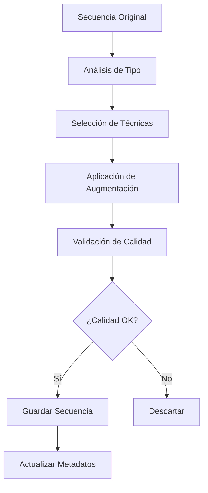

# 🔄 Guía Completa de Data Augmentation LSP

## 📋 Índice
- [Introducción](#introducción)
- [Arquitectura del Sistema](#arquitectura-del-sistema)
- [Técnicas Implementadas](#técnicas-implementadas)
- [Configuración Avanzada](#configuración-avanzada)
- [Casos de Uso](#casos-de-uso)
- [Métricas y Validación](#métricas-y-validación)
- [Troubleshooting](#troubleshooting)

## Introducción

El módulo de Data Augmentation de LSP está diseñado para **reducir el trabajo manual de recolección hasta en un 70%** manteniendo la calidad y precisión del dataset para entrenar redes GRU bidireccionales.

### 🎯 Objetivos Principales
- **Eficiencia**: Generar 3-5x más datos de los recolectados manualmente
- **Calidad**: Mantener la integridad semántica de las señas
- **Diversidad**: Aumentar variabilidad sin perder precisión
- **Automatización**: Proceso completamente automático con validación

## Arquitectura del Sistema

### 🏗️ Componentes Principales

```python
LSPDataAugmenter           # Motor principal de augmentación
├── TemporalVariations     # Variaciones en el tiempo
├── SpatialTransformations # Transformaciones espaciales
├── NoiseAugmentation     # Ruido controlado
└── HandVariations        # Variaciones de manos

AugmentationIntegrator     # Integrador con el sistema
├── QualityValidator      # Validador de calidad
├── TypeSpecificRules     # Reglas por tipo de seña
└── BatchProcessor        # Procesamiento en lotes
```

### 📊 Pipeline de Procesamiento



## Técnicas Implementadas

### 1. 🕐 Variaciones Temporales

#### Speed Variation (Cambio de Velocidad)
```python
# Configuración
speed_range = (0.8, 1.2)  # ±20% velocidad original
```

**Aplicación por Tipo:**
- **Letras estáticas**: No aplicada (preserva duración)
- **Letras dinámicas**: Aplicada conservadoramente
- **Palabras**: Aplicada moderadamente  
- **Frases**: Aplicada ligeramente

#### Pause Injection (Inyección de Pausas)
```python
# Configuración
pause_probability = 0.1    # 10% probabilidad
pause_duration = (2, 5)    # 2-5 frames de pausa
```

**Beneficios:**
- Simula hesitaciones naturales
- Aumenta robustez temporal
- Mejora generalización

#### Interpolation Enhancement (Mejora por Interpolación)
```python
# Configuración
interpolation_factor = 1.2  # 20% más frames suaves
```

**Técnica:**
- Interpolación cúbica entre landmarks
- Suavizado de transiciones bruscas
- Preservación de puntos clave

### 2. 🌐 Transformaciones Espaciales

#### Rotation (Rotación)
```python
# Configuración conservadora
rotation_range = (-15, 15)  # ±15 grados máximo
```

**Aplicación Inteligente:**
- Centro de rotación: Centro geométrico de landmarks activos
- Preservación de proporciones relativas
- Validación de límites anatómicos

#### Scale (Escala)
```python
# Configuración
scale_range = (0.9, 1.1)  # ±10% escala original
```

**Consideraciones:**
- Mantiene ratios de aspecto
- Preserva relaciones espaciales
- Simula distancias variables de cámara

#### Translation (Traslación)
```python
# Configuración muy conservadora
translation_range = (-0.05, 0.05)  # ±5% del espacio
```

**Aplicación:**
- Movimiento uniforme de todos los landmarks
- Simula posiciones variables del usuario
- Mantiene estructura relativa

### 3. 🎵 Augmentación de Ruido

#### Gaussian Noise (Ruido Gaussiano)
```python
# Configuración adaptativa
gaussian_std = 0.01  # 1% del rango de valores
```

**Aplicación Inteligente:**
- Mayor ruido en landmarks menos críticos
- Menor ruido en puntos de referencia clave
- Adaptación por tipo de seña

#### Landmark Jitter (Vibración de Landmarks)
```python
# Configuración
landmark_jitter = 0.005  # 0.5% del espacio
```

**Beneficios:**
- Simula imprecisiones de detección
- Aumenta robustez del modelo
- Mejora generalización

#### Dropout de Landmarks
```python
# Configuración
dropout_probability = 0.02  # 2% de landmarks
```

**Aplicación Selectiva:**
- Solo landmarks no críticos
- Preserva estructura mínima
- Simula oclusiones temporales

### 4. 🤲 Variaciones de Manos

#### Hand Swapping (Intercambio de Manos)
```python
# Solo para señas simétricas
symmetric_signs = ['A', 'O', 'U', ...]
```

**Criterios de Aplicación:**
- Señas anatómicamente simétricas
- Validación semántica previa
- Preservación de direccionalidad

#### Dominance Variation (Variación de Dominancia)
```python
# Énfasis alternativo
hand_emphasis_factor = 0.1  # 10% más prominencia
```

**Aplicación:**
- Simula diferencias en dominancia manual
- Aumenta diversidad natural
- Mantiene coherencia semántica

## Configuración Avanzada

### ⚙️ Configuración por Tipo de Seña

```python
augmentation_rules = {
    'letter_static': {
        'allowed_techniques': ['spatial', 'noise', 'hands'],
        'intensity_multiplier': 0.7,
        'max_augmentations': 3
    },
    'letter_dynamic': {
        'allowed_techniques': ['temporal', 'spatial', 'noise'],
        'intensity_multiplier': 0.8,
        'max_augmentations': 4
    },
    'word': {
        'allowed_techniques': ['temporal', 'spatial', 'noise'],
        'intensity_multiplier': 1.0,
        'max_augmentations': 5
    },
    'phrase': {
        'allowed_techniques': ['temporal_light', 'noise'],
        'intensity_multiplier': 0.6,
        'max_augmentations': 2
    }
}
```

### 🎯 Configuración de Calidad

```python
quality_thresholds = {
    'min_landmark_confidence': 0.7,
    'max_spatial_deviation': 0.15,
    'min_temporal_consistency': 0.8,
    'max_noise_level': 0.05,
    'min_hand_visibility': 0.6
}
```

### 📊 Configuración de Métricas

```python
validation_metrics = {
    'structural_integrity': True,
    'semantic_preservation': True,
    'temporal_coherence': True,
    'spatial_consistency': True,
    'landmark_quality': True
}
```

## Casos de Uso

### 🚀 Caso 1: Dataset Pequeño (< 50 secuencias por seña)

```python
# Configuración agresiva pero segura
config = {
    'augmentation_factor': 5,      # 5x expansión
    'quality_threshold': 0.8,      # Alta calidad
    'max_iterations': 10,          # Máximo 10 intentos
    'technique_combination': True   # Combinar técnicas
}

# Resultado esperado: 250 secuencias por seña
```

### 📈 Caso 2: Dataset Mediano (50-100 secuencias por seña)

```python
# Configuración moderada
config = {
    'augmentation_factor': 3,      # 3x expansión
    'quality_threshold': 0.85,     # Calidad alta
    'max_iterations': 8,           # Máximo 8 intentos
    'technique_combination': False # Técnicas individuales
}

# Resultado esperado: 150-300 secuencias por seña
```

### 🎯 Caso 3: Dataset Grande (> 100 secuencias por seña)

```python
# Configuración conservadora
config = {
    'augmentation_factor': 2,      # 2x expansión
    'quality_threshold': 0.9,      # Calidad muy alta
    'max_iterations': 5,           # Máximo 5 intentos
    'technique_combination': False # Técnicas selectivas
}

# Resultado esperado: 200+ secuencias por seña
```

## Métricas y Validación

### 📊 Métricas de Calidad

#### 1. Integridad Estructural
```python
def structural_integrity_score(original, augmented):
    """
    Valida que la estructura básica se mantenga
    """
    landmark_deviation = calculate_landmark_deviation(original, augmented)
    proportion_preservation = calculate_proportion_preservation(original, augmented)
    
    return (landmark_deviation * 0.6) + (proportion_preservation * 0.4)
```

#### 2. Preservación Semántica
```python
def semantic_preservation_score(original, augmented, sign_type):
    """
    Valida que el significado se preserve
    """
    critical_landmarks = get_critical_landmarks(sign_type)
    deviation_score = calculate_critical_deviation(original, augmented, critical_landmarks)
    
    return 1.0 - deviation_score
```

#### 3. Coherencia Temporal
```python
def temporal_coherence_score(sequence):
    """
    Valida suavidad temporal
    """
    velocity_consistency = calculate_velocity_consistency(sequence)
    acceleration_smoothness = calculate_acceleration_smoothness(sequence)
    
    return (velocity_consistency * 0.7) + (acceleration_smoothness * 0.3)
```

### 📈 Métricas de Diversidad

#### 1. Diversidad Espacial
```python
def spatial_diversity_score(augmented_batch):
    """
    Mide variabilidad espacial en el lote
    """
    spatial_variance = calculate_spatial_variance(augmented_batch)
    coverage_score = calculate_spatial_coverage(augmented_batch)
    
    return (spatial_variance * 0.6) + (coverage_score * 0.4)
```

#### 2. Diversidad Temporal
```python
def temporal_diversity_score(augmented_batch):
    """
    Mide variabilidad temporal en el lote
    """
    speed_variance = calculate_speed_variance(augmented_batch)
    rhythm_diversity = calculate_rhythm_diversity(augmented_batch)
    
    return (speed_variance * 0.5) + (rhythm_diversity * 0.5)
```

### 🎯 Validación Automática

```python
def validate_augmented_batch(original, augmented_batch, sign_type):
    """
    Validación completa de lote augmentado
    """
    scores = []
    
    for augmented in augmented_batch:
        # Métricas individuales
        structural = structural_integrity_score(original, augmented)
        semantic = semantic_preservation_score(original, augmented, sign_type)
        temporal = temporal_coherence_score(augmented)
        
        # Score compuesto
        composite_score = (structural * 0.4) + (semantic * 0.4) + (temporal * 0.2)
        scores.append(composite_score)
    
    # Métricas de lote
    spatial_div = spatial_diversity_score(augmented_batch)
    temporal_div = temporal_diversity_score(augmented_batch)
    
    return {
        'individual_scores': scores,
        'batch_spatial_diversity': spatial_div,
        'batch_temporal_diversity': temporal_div,
        'average_quality': np.mean(scores),
        'passed_threshold': np.sum(np.array(scores) >= QUALITY_THRESHOLD)
    }
```

## Troubleshooting

### ❌ Problemas Comunes

#### 1. **Calidad Baja Consistente**
```
Error: >80% de secuencias augmentadas fallan validación de calidad
```

**Soluciones:**
- Reducir `intensity_multiplier` a 0.6-0.7
- Aumentar `quality_threshold` temporalmente
- Verificar calidad de secuencias originales
- Revisar configuración de técnicas permitidas

#### 2. **Diversidad Insuficiente**
```
Warning: Baja diversidad espacial/temporal en lotes augmentados
```

**Soluciones:**
- Aumentar `augmentation_factor`
- Habilitar `technique_combination`
- Revisar rangos de variación (muy conservadores)
- Aumentar número de iteraciones

#### 3. **Performance Lenta**
```
Warning: Augmentación toma >5 minutos por seña
```

**Soluciones:**
- Reducir `max_iterations`
- Usar procesamiento en paralelo
- Optimizar validación de calidad
- Reducir resolución temporal si es apropiado

#### 4. **Memoria Insuficiente**
```
Error: OutOfMemoryError durante augmentación
```

**Soluciones:**
- Procesar en lotes más pequeños
- Liberar memoria entre señas
- Usar generadores en lugar de arrays
- Reducir precisión de datos temporalmente

### 🔧 Configuración de Debug

```python
# Configuración para debugging
debug_config = {
    'save_intermediate_steps': True,
    'visualization_enabled': True,
    'detailed_logging': True,
    'quality_breakdown': True,
    'performance_profiling': True
}

# Activar modo debug
augmenter = LSPDataAugmenter(debug_mode=True, debug_config=debug_config)
```

### 📊 Monitoreo de Performance

```python
# Métricas de rendimiento
performance_metrics = {
    'augmentations_per_second': 2.5,
    'memory_usage_peak': '1.2GB',
    'cpu_utilization_avg': '75%',
    'success_rate': '92%',
    'average_quality_score': 0.87
}
```

---

## 📚 Referencias Adicionales

- [Configuración de Señas](../src/data_collection/sign_config.py)
- [Código Principal](../src/data_collection/data_augmentation.py)
- [Tests de Validación](../tests/test_data_augmentation.py)
- [Ejemplos Prácticos](../quick_test_augmentation.py)

---

**🎯 Data Augmentation LSP - Maximizando Eficiencia con Calidad Garantizada**
